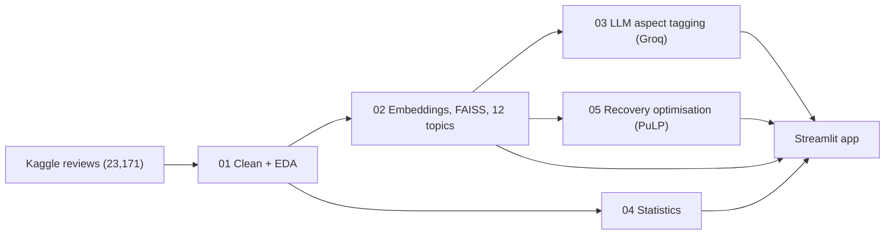

# Airline Customer Experience & Commercial Insights Copilot

Passenger reviews turned into topics, aspect-level sentiment, statistics, and a service-recovery capacity plan, with a question-answering copilot grounded in the reviews.

**Live demo:** https://airline-cx-copilot-z2w33rhceqot46dpjretrx.streamlit.app/

## What it does
- **Insights:** 12 semantic topics (sentence embeddings + k-means) and LLM-tagged sentiment on six aspects: seat, crew, food, ground/baggage, delays, value.
- **Drivers:** which factors relate to "would recommend", cabin and airline differences with confidence intervals, and a trend check.
- **Optimizer:** allocates limited service-recovery hours across complaint topic x cabin segments (integer linear program) and compares it with simple baselines.
- **Copilot:** retrieves the most relevant reviews (MiniLM embeddings + FAISS) and answers using only those reviews, with citations.

## Key findings
| Question | Finding |
|---|---|
| Cabin effect | Recommend rate: Economy 33.4%, Premium Economy 34.4%, Business 54.8%, First 58.4%. Business/First minus Economy = **+21.7 points** (95% CI +19.5 to +23.8). Premium Economy is not different from Economy. |
| What drives "recommend"? | Odds ratio per +1 star: value for money **3.72**, ground service 1.96, cabin staff 1.66, seat comfort 1.50, food 1.47 (13,094 complete cases). Associations, not causes. After adjusting for these ratings, cabin class no longer matters. |
| Airlines | 167 of 248 airlines differ from the overall rate after FDR correction (1.4% to 98%). With about 100 reviews each (CI about +/-0.09), read tiers, not exact ranks. |
| Trend | Pooled recommend rate fell from about 41% (2015-2019) to about 25% (2022-2023), but mostly through changing airline mix. Among 42 airlines with enough reviews in both periods the average change was **-4.8 points** (60% declined, Wilcoxon p = 0.048, borderline). |
| Aspects | Delays, ground/baggage and value are the most negative aspects (about 73-76% of mentions negative); food is the only aspect with more positive than negative mentions. |
| Recovery plan | LP beats first-come-first-served by about **85%** in expected retained value, but only **1.4%** better than a simple "premium cabins first" rule (better in 94.9% of assumption-error draws). A 10% fairness floor costs 9.2% of the optimum. |

## Architecture


## Notebooks
| Notebook | What it does |
|---|---|
| `01_data_eda` | Load, clean and explore the reviews; fix a rating-coding problem (see Data quality). |
| `02_semantic_analysis` | MiniLM embeddings, FAISS index, k-means topics, topic naming. |
| `03_llm_aspect_sentiment` | Aspect-level sentiment with `gpt-oss-20b` (Groq), evaluation on a gold set, independent check against passenger sub-ratings. |
| `04_statistics` | Confidence intervals, chi-square, Kruskal-Wallis, Mann-Whitney, logistic regression, FDR-corrected airline tests, trend check. |
| `05_optimization` | Integer program for recovery capacity, baselines, capacity curve, robustness to wrong assumptions. |

## Data quality
- 23,171 raw reviews became 22,297 after removing rows with missing ratings, very short reviews (<50 characters) and duplicates.
- The source stores some 10/10 ratings as 1. I found 2,264 rows (about 10%) with rating 1 but "recommended = yes" and sub-ratings averaging about 4.6 (versus about 1.4 for other 1-star reviews) and re-coded them to 10. This is a heuristic; a few genuine 1-star reviewers may also be marked "recommended".

## Evaluation of the aspect tagging
Gold set: 100 reviews x 6 aspects (600 labels), drafted by `gpt-oss-120b`; the 72 labels (12%) where it disagreed with `gpt-oss-20b` were re-decided manually (single annotator).
<!-- If you did NOT review those 72 labels carefully, replace the sentence above with:
     "Gold labels are those of the larger model (gpt-oss-120b) with no human verification, so the scores measure agreement with a stronger model." -->

| Aspect | Accuracy | Macro F1 |
|---|---|---|
| seat | 0.96 | 0.958 |
| food | 0.95 | 0.918 |
| delays | 0.93 | 0.913 |
| crew | 0.87 | 0.865 |
| value | 0.86 | 0.847 |
| ground/baggage | 0.84 | 0.811 |

Mean macro F1: **0.885**. These numbers are optimistic: both models agree on 88% of labels by construction and those were not independently verified.

**Independent check:** on 300 tagged reviews, the model's positive/negative label agrees with the passenger's own sub-rating (>=4 vs <=2) for 88-97% of reviews (n = 74-141 per aspect). This validates polarity only; delays have no sub-rating in the data.

## Recovery optimisation
Case counts (3,707 at-risk cases in 23 segments) come from the review sample. **Revenue values, recovery probabilities and handling times are illustrative assumptions** (editable in the app) and must be replaced with operational data before any real use. Expected retained value at 25% team capacity (relative units): proportional 439.8, premium-first 802.4, LP 813.8, LP with 10% coverage floor 739.2.

## Limitations
- Reviewers are self-selected and skew negative (65% did not recommend); results describe reviewers, not all passengers.
- The dataset holds about 100 reviews per airline, so airline-level results are tiers, not exact rankings.
- Aspect tagging was run on 300 reviews; the 20B model sees the first 1,200 characters of each review; First Class and Premium Economy have too few tagged reviews for cabin comparisons.
- Topics overlap (silhouette about 0.03) and two clusters are driven by place names.
- Logistic regression results are associations on complete cases only; the near-perfect fit reflects that sub-ratings and "recommend" come from the same reviewer.
- The optimisation depends on assumed values, recovery rates and handling times.

## Run locally
```bash
pip install -r requirements.txt
streamlit run app.py
```
For the Copilot's written answers, add `GROQ_API_KEY = "..."` to `.streamlit/secrets.toml`. Without a key it still shows the retrieved reviews. The notebooks were run in Google Colab; notebook 03 also needs a Groq API key stored as a Colab secret.

## Repo structure
```
app.py               Streamlit app
requirements.txt
notebooks/           01-05 analysis notebooks
data/                precomputed tables, embeddings and FAISS index used by the app
```

## Data
Airline reviews scraped from airlinequality.com, via the Kaggle dataset *Airline Reviews* (`juhibhojani/airline-reviews`). Check the dataset page for its license and terms before reuse.

## Tech
Python, pandas, scikit-learn, statsmodels, sentence-transformers / fastembed (MiniLM), FAISS, PuLP, Groq (`gpt-oss-20b`, `gpt-oss-120b`), Streamlit.

Built by Dhayal R.
